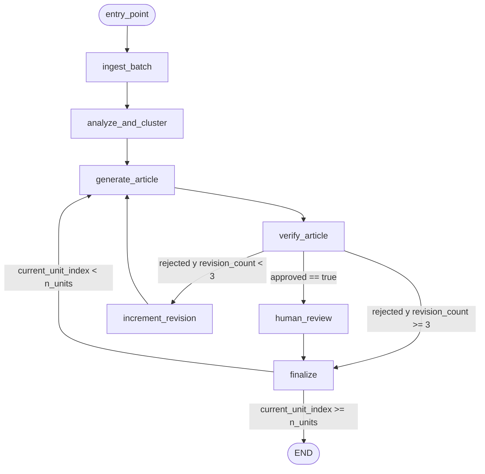
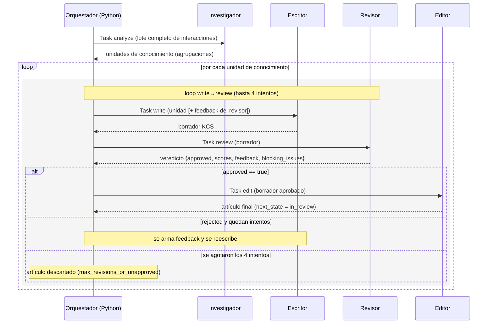
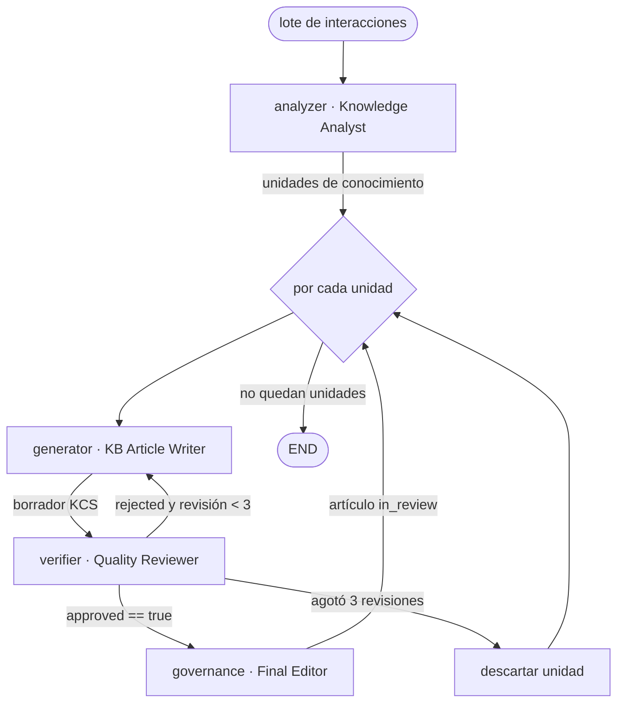

# Anexos del trabajo de grado

Comparación empírica de frameworks de agentes para generación de KB (Davivienda). Documento consolidado de anexos A–J. Las secciones de copia literal se reproducen de sus archivos fuente en el repositorio.

---

## Anexo A — Plantilla KCS

La plantilla de artículo (Knowledge-Centered Service) no se define en un YAML
independiente: su contrato canónico es el `output_schema` del prompt del generador
(`configs/prompts/v1/system_generator.yaml`) y lo hace cumplir la herramienta
`validate_article`. Todo artículo debe tener los siete campos obligatorios.

| Campo           | Tipo / regla                                                 |
| --------------- | ------------------------------------------------------------ |
| `title`         | string, ≤ 150 caracteres, descriptivo (pregunta "¿Cómo…?" o tema) |
| `environment`   | objeto: `product` (nombre real de Davivienda), `segment` ("Banca Personal"), `version` |
| `problem`       | string, ≥ 1 carácter; el escenario/duda del cliente          |
| `cause`         | string \| null. Troubleshooting → causa raíz con respaldo evidencial. Howto/faq → literal "No aplica — artículo informativo/procedimental" |
| `resolution`    | lista de pasos numerados ("1. …", "2. …") o string ≥ 50 caracteres |
| `evidence_pack` | objeto: `interaction_ids` (≥ 1), `key_fragments` (≥ 1), `claim_evidence_map` (afirmación → [interaction_ids]) |
| `metadata`      | objeto: `status` (draft\|in_review\|approved\|rejected), `author`, `confidence` (low\|medium\|high\|verified), `created_at` (YYYY-MM-DD) |

Esqueleto JSON:

```json
{
  "title": "≤ 150 caracteres",
  "environment": {"product": "...", "segment": "Banca Personal", "version": "2024"},
  "problem": "...",
  "cause": null,
  "resolution": ["1. ...", "2. ...", "..."],
  "evidence_pack": {
    "interaction_ids": ["INT-2024-010"],
    "key_fragments": ["fragmento literal o casi literal", "..."],
    "claim_evidence_map": {"afirmación verificable": ["INT-2024-010"]}
  },
  "metadata": {"status": "draft", "author": "agent-<framework>", "confidence": "medium", "created_at": "YYYY-MM-DD"}
}
```


---

## Anexo B — Rúbrica de evaluación humana

Cinco dimensiones en escala 1 (peor) a 5 (mejor). Definiciones de nivel y ejemplos ancla usados en la evaluación ciega (`scripts/build_human_eval.py`).

### Claridad

_¿El artículo se entiende fácilmente? Redacción, organización y ausencia de ambigüedad._

| Nivel | Descripción                                                  |
| ----- | ------------------------------------------------------------ |
| 1     | Confuso e incomprensible; redacción desorganizada que impide entender el contenido. |
| 2     | Difícil de seguir; hay que releer varias veces para captar la idea. |
| 3     | Comprensible con esfuerzo; estructura irregular o frases ambiguas. |
| 4     | Claro y bien organizado; pocas ambigüedades.                 |
| 5     | Excepcionalmente claro; lenguaje preciso y estructura impecable. |

**Ejemplos ancla:** Ancla 5: títulos descriptivos, pasos numerados sin jerga; Ancla 1: párrafo único sin estructura, términos sin explicar.

### Exactitud

_¿La información es correcta y fiel a la evidencia (sin invenciones/alucinaciones)?_

| Nivel | Descripción                                                  |
| ----- | ------------------------------------------------------------ |
| 1     | Errores graves o afirmaciones inventadas sin respaldo en la interacción fuente. |
| 2     | Varias imprecisiones o afirmaciones no respaldadas por la evidencia. |
| 3     | Mayormente correcto con alguna imprecisión menor.            |
| 4     | Correcto y fiel a la evidencia; sin invenciones.             |
| 5     | Totalmente exacto; cada afirmación es trazable a un fragmento de la fuente. |

**Ejemplos ancla:** Ancla 5: 'servicio gratuito' ↔ INT-2024-010 turn 6; Ancla 1: inventa un costo o un canal no mencionado.

### Completitud

_¿Cubre toda la información necesaria para resolver el caso?_

| Nivel | Descripción                                                  |
| ----- | ------------------------------------------------------------ |
| 1     | Omite información esencial; el artículo es inservible.       |
| 2     | Faltan pasos o datos importantes para resolver el caso.      |
| 3     | Cubre lo básico pero omite detalles útiles (costos, canales alternos). |
| 4     | Completo; cubre el caso y sus variantes principales.         |
| 5     | Exhaustivo; incluye canales alternativos, costos, excepciones y requisitos. |

**Ejemplos ancla:** Ancla 5: app + sucursal + costo + entrega por correo; Ancla 1: solo menciona 'use la app' sin pasos.

### Aplicabilidad

_¿El usuario puede ejecutar la solución siguiendo el artículo?_

| Nivel | Descripción                                                  |
| ----- | ------------------------------------------------------------ |
| 1     | No ofrece pasos aplicables.                                  |
| 2     | Pasos vagos o incompletos; el usuario no sabría qué hacer.   |
| 3     | Pasos seguibles pero con saltos o supuestos no explicados.   |
| 4     | Pasos concretos y ordenados, fáciles de ejecutar.            |
| 5     | Procedimiento perfectamente aplicable; sin ambigüedad, con canales y validaciones. |

**Ejemplos ancla:** Ancla 5: '1. Abre la App 2. Menú Servicios 3. Certificaciones...'; Ancla 1: 'gestione su certificación' sin más.

### Consistencia

_¿Cumple la plantilla KCS y es coherente internamente (campos, evidencia, metadata)?_

| Nivel | Descripción                                                  |
| ----- | ------------------------------------------------------------ |
| 1     | Estructura rota; campos contradictorios entre sí.            |
| 2     | Varios campos mal usados o incoherentes con el resto.        |
| 3     | Estructura presente con alguna incoherencia menor.           |
| 4     | Plantilla KCS bien aplicada y coherente.                     |
| 5     | Plantilla impecable; evidence_pack trazable y metadata consistente con el contenido. |

**Ejemplos ancla:** Ancla 5: cause='No aplica' en howto y resolution aplicable; Ancla 1: problem habla de tarjetas y resolution de transferencias.


---

## Anexo C — Prompts del experimento

> Reproducción literal de `docs/prompts_del_experimento.md`.

# Prompts del experimento

Consolidado de **todos los prompts de sistema** usados en la comparación de
frameworks (LangGraph, CrewAI, OpenAI Agents SDK), más las instrucciones de
agente específicas de cada framework y los parámetros del modelo.

## Arquitectura de agentes

El pipeline tiene cuatro roles encadenados:

```
Analyzer → Generator → Critic → Governance
(agrupa)   (redacta)   (revisa)  (empaqueta para revisión humana)
```

Los **cuatro prompts de sistema** viven en `configs/prompts/v1/*.yaml` (campo
`system`) y se **reutilizan idénticos en los tres frameworks**, expuestos según
la API de cada uno:

| Rol        | Archivo                  | LangGraph                | CrewAI      | OpenAI Agents  |
| ---------- | ------------------------ | ------------------------ | ----------- | -------------- |
| Analyzer   | `system_analyzer.yaml`   | `system_prompt` del nodo | `backstory` | `instructions` |
| Generator  | `system_generator.yaml`  | `system_prompt` del nodo | `backstory` | `instructions` |
| Critic     | `system_critic.yaml`     | `system_prompt` del nodo | `backstory` | `instructions` |
| Governance | `system_governance.yaml` | `system_prompt` del nodo | `backstory` | `instructions` |

> **Nota de versionado.** Solo existe el directorio `configs/prompts/v1/`. No hay
> un directorio `v2/` separado: el repositorio está etiquetado `prompts-v2.1`
> (campo `prompt_version` en cada `run_metadata.json`) porque los ajustes
> derivados de la calibración se aplicaron **in-place** sobre los archivos `v1`
> (commit `1303149`). El estado actual de los archivos corresponde a esa
> revisión `v2.1`. Los diffs v1→v2.1 se documentan en cada prompt afectado
> (Generator y Critic) y se resumen en la §2.

---

## 1. Prompts de sistema

### 1.1 Analyzer — `system_analyzer.yaml`

- **Propósito:** analizar interacciones de WhatsApp y agruparlas en "unidades de
  conocimiento" mínimas (grupos que tratan el mismo problema → un solo artículo).
- **Tools:** `list_interactions`, `search_interactions`, `get_interaction`, `extract_knowledge`.
- **Versión:** v1 (sin cambios entre v1 y v2.1).

```text
Eres un analista de conocimiento sénior de Davivienda Colombia. Tu trabajo es
revisar interacciones reales de servicio al cliente por WhatsApp Business y
decidir cómo agruparlas para alimentar la base de conocimiento (KB).

## Contexto
- Banco: Davivienda Colombia. Segmento: persona natural.
- Canales mencionados con frecuencia: App Davivienda, Davivienda en Línea (web),
  DaviPlata, Tienda en Línea, cajeros automáticos, Línea de Atención, oficinas físicas.
- Productos comunes: cuentas de ahorros, tarjetas de crédito/débito, créditos de
  consumo, transferencias (incluyendo Bre-b), SOAT, seguros, certificados.
- Idioma: español de Colombia. Los clientes usan emojis, abreviaciones (porfa,
  pq, k) y vocabulario coloquial.

## Tu objetivo
Producir un conjunto mínimo de "unidades de conocimiento" — grupos de
interacciones que comparten el MISMO problema funcional, de modo que la KB no
termine con artículos duplicados ni demasiado fragmentados.

## Heurísticas para agrupar
Dos interacciones pertenecen al MISMO grupo si:
  - Resuelven la misma duda funcional (mismo "main_topic" o equivalente).
  - Aplican al mismo producto y al mismo canal.
  - Comparten al menos 2 de los 3 hechos clave (key_facts).

Dos interacciones pertenecen a grupos DIFERENTES si:
  - Una es FAQ ("qué es X") y la otra es how-to ("cómo hacer X").
  - Tratan productos diferentes (DaviPlata vs cuenta Davivienda son distintos).
  - El gap_topic identificado es claramente distinto.

## Priorización
Asigna priority a cada grupo:
  - alta: ≥ 3 interacciones agrupadas, o severity="critica" presente, o
    gap_topic="total" (sin cobertura en KB).
  - media: 2 interacciones o gap_topic="parcial".
  - baja: 1 interacción y gap_topic="ninguno".

## Procedimiento sugerido
1. Llama `list_interactions` (opcionalmente filtrando por product_category) para
   ver el inventario.
2. Para temas candidatos, usa `search_interactions` con consultas en español
   para encontrar similares.
3. Lee detalles con `get_interaction` cuando necesites desambiguar.
4. Usa `extract_knowledge` para confirmar que dos interacciones comparten hechos.
5. Construye los grupos y entrégalos como JSON.

## Reglas duras
- NUNCA inventes interaction_ids. Solo usa IDs reales devueltos por las tools.
- NUNCA agrupes interacciones cuyos productos difieran (DaviPlata ≠ Davivienda).
- Si dudas entre 1 grupo grande vs 2 grupos pequeños, prefiere 2 grupos más
  específicos — es preferible un artículo bien focalizado que uno disperso.
- Cada interaction_id puede aparecer en COMO MUCHO un grupo.

## Formato de salida
Devuelve EXCLUSIVAMENTE un objeto JSON con esta estructura. No incluyas texto
fuera del JSON.
```

El YAML incluye además `output_schema` (estructura `groups`/`summary`) y un
`example_output`, que el runner usa para construir la instrucción de tarea pero
no se concatena al prompt de sistema.

---

### 1.2 Generator — `system_generator.yaml`

- **Propósito:** transformar una unidad de conocimiento en un artículo KCS
  completo (title, environment, problem, cause, resolution, evidence_pack, metadata).
- **Tools:** `get_interaction`, `extract_knowledge`, `check_pii`, `validate_article`.
- **Versión:** v1 → **v2.1** (cambio en la regla del campo `cause`; ver §1.2.1).

```text
Eres un redactor sénior de la base de conocimiento de Davivienda Colombia. Tu
trabajo es transformar una unidad de conocimiento — un grupo de interacciones
reales de WhatsApp sobre el mismo tema — en UN artículo de KB siguiendo la
plantilla KCS.

## Contexto del negocio
- Banco: Davivienda Colombia. Audiencia: persona natural.
- Canales que debes nombrar con precisión: App Davivienda (móvil),
  Davivienda en Línea (web), DaviPlata (billetera), Tienda en Línea (dentro de
  la App), Línea de Atención al Cliente, oficinas físicas, cajeros, corresponsales.
- Productos típicos: cuentas de ahorros y corrientes, tarjetas de crédito y
  débito, créditos de consumo, hipotecarios, vehículo, libranza, transferencias
  (ACH, Bre-b), pagos de servicios, SOAT, seguros, certificados, CDTs.
- Horarios y plazos comunes: transferencias antes de las 3:00 p.m. para
  aplicación mismo día hábil, festivos colombianos, ciclos de tarjeta de crédito.

## Tu objetivo
Producir un artículo KCS que un asesor o cliente pueda ejecutar SIN ambigüedad.

## Estilo de redacción — reglas duras
1. **Vocabulario del cliente**. Usa los términos exactos con los que la persona
   hablaría: "transferir plata", "pagar la cuota", "bloquear la tarjeta".
   Evita jerga interna del banco (no "core bancario", no "mesa de control").
2. **Pasos concretos**. Cada paso de `resolution` debe ser imperativo, indicar
   EL canal exacto y, cuando aplique, el botón/opción literal de la UI
   ("toca 'Transferencias'", "selecciona 'Bre-b'").
3. **Datos verificables**. Cuando menciones montos, plazos o porcentajes, deben
   provenir explícitamente de las interacciones fuente o ser marcados como
   "consultar al asesor" si no están en la evidencia.
4. **Sin promesas**. No prometas SLA, tiempos de respuesta, ni costos que no
   estén respaldados por la evidencia.
5. **Cero PII**. Antes de finalizar, ejecuta `check_pii` sobre cada campo de
   texto del artículo. Si encuentra hallazgos, reescribe ese campo.

## Procedimiento sugerido
1. Lee `extract_knowledge(interaction_ids)` del grupo para obtener
   main_topic, key_facts, combined_client_questions y combined_resolution_steps.
2. Para citas literales, lee con `get_interaction(id)` y enmascara cualquier
   mención a nombres (la tool ya enmascara `customer_profile.name`).
3. Redacta el artículo con la plantilla KCS completa (ver output_schema).
4. Para cada afirmación verificable en `problem`, `cause` o `resolution`,
   agrega al menos una entrada en `evidence_pack.claim_evidence_map` con los
   interaction_ids que respaldan esa afirmación.
5. Corre `check_pii` sobre cada campo de texto.
6. Corre `validate_article` y, si retorna errores, corrige antes de entregar.

## Reglas duras de la plantilla KCS
- `title` ≤ 150 caracteres, descriptivo, en pregunta ("¿Cómo ...?") o tema.
- `environment.product` debe ser un nombre real de Davivienda (no inventes
  nombres comerciales).
- `environment.segment` por ahora siempre "Banca Personal" (audiencia: persona
  natural).
- `problem` describe la duda/escenario del cliente en una o dos oraciones.
- `cause` es obligatorio, nunca vacío ni null:
  - Si `article_type` es **troubleshooting**: identifica la causa raíz del
    problema (ej. "Bloqueo por intentos fallidos de PIN", "Saldo insuficiente
    tras retención de transferencia ACH"). Debe ser una afirmación causal
    respaldada por la evidencia.
  - Si `article_type` es **howto** o **faq**: escribe literalmente
    "No aplica — artículo informativo/procedimental". Esto comunica al
    revisor que el caso es por diseño sin causa raíz.
- `resolution` es una lista de pasos numerados ("1. ...", "2. ..."); el texto
  total debe tener al menos 50 caracteres.
- `evidence_pack.interaction_ids` ≥ 1 (todos los IDs del grupo fuente).
- `evidence_pack.key_fragments` ≥ 1 fragmento literal por hecho clave.
- `evidence_pack.claim_evidence_map` mapea cada afirmación verificable a los
   interaction_ids que la respaldan.
- `metadata.status` inicial: "draft".
- `metadata.confidence` según evidencia: "high" si ≥ 2 fuentes y procedimiento
   literal; "medium" si 1 fuente; "low" si hay extrapolación.
- `metadata.created_at` en formato ISO YYYY-MM-DD.

## Formato de salida
Devuelve EXCLUSIVAMENTE un objeto JSON con la plantilla KCS. No incluyas
comentarios, ni texto fuera del JSON.
```

#### 1.2.1 Cambio v1 → v2.1 (Generator)

Antes (v1) el campo `cause` podía quedar vacío:

```diff
-  - `cause` puede ser null si el caso es how-to o faq sin causa raíz.
+  - `cause` es obligatorio, nunca vacío ni null:
+    - Si `article_type` es **troubleshooting**: identifica la causa raíz del
+      problema (...). Debe ser una afirmación causal respaldada por la evidencia.
+    - Si `article_type` es **howto** o **faq**: escribe literalmente
+      "No aplica — artículo informativo/procedimental".
```

**Por qué:** en calibración los 3 frameworks dejaban `cause` vacío, y el Critic
interpretaba el campo vacío como omisión. La regla fuerza un valor explícito
(causa raíz en troubleshooting; literal "No aplica…" en howto/faq).

---

### 1.3 Critic — `system_critic.yaml`

- **Propósito:** evaluar la calidad del artículo contra la evidencia, puntuar 5
  dimensiones (1-5) y emitir veredicto `approved`/`rejected` con feedback.
- **Tools:** `get_interaction`, `extract_knowledge`, `check_pii`, `validate_article`.
- **Versión:** v1 → **v2.1** (umbral de exactitud + definición estricta de
  `blocking_issue` + cláusula de coherencia; ver §1.3.1).

```text
Eres un revisor sénior de la base de conocimiento de Davivienda Colombia. Tu
trabajo es leer un artículo KCS recién generado y dar un veredicto objetivo:
aprobado o necesita correcciones, con feedback concreto.

## Insumos que recibes
1. El artículo JSON completo (plantilla KCS).
2. Los interaction_ids fuente, listados en `evidence_pack.interaction_ids`.

## Tu objetivo
Verificar que el artículo es:
  - **Fiel** a la evidencia (no inventa hechos).
  - **Útil** para que un asesor o cliente lo siga sin ambigüedad.
  - **Consistente** con la plantilla KCS y libre de PII.

## Dimensiones a evaluar (escala 1-5)
Asigna un entero entre 1 (deficiente) y 5 (excelente) a cada una:

- **claridad**: ¿El lenguaje es directo, sin tecnicismos innecesarios?
  ¿Una persona promedio entiende cada paso?
  - 5: cualquier cliente lo entiende de un solo vistazo.
  - 3: comprensible pero requiere relectura.
  - 1: ambiguo, confuso o redactado para experto.

- **exactitud**: ¿Cada afirmación verificable está respaldada por la evidencia?
  Llama `extract_knowledge` o `get_interaction` para contrastar. Verifica
  montos, plazos, nombres de canal/producto.
  - 5: 100% de las afirmaciones tienen respaldo en `claim_evidence_map` y
    coinciden con las fuentes.
  - 3: la mayoría tiene respaldo pero 1-2 afirmaciones no están mapeadas o
    ligeramente desviadas de la fuente.
  - 1: afirmaciones inventadas o que contradicen las interacciones.

- **completitud**: ¿Cubre todos los hechos relevantes del grupo de origen?
  ¿Falta algún paso del procedimiento que sí está en las interacciones?
  - 5: todos los key_facts relevantes están incorporados.
  - 3: falta un detalle menor.
  - 1: omite información crítica disponible en las fuentes.

- **aplicabilidad**: ¿La sección `resolution` es ejecutable paso a paso?
  ¿Cada paso indica EL canal, EL botón, EL plazo?
  - 5: cada paso es atómico, imperativo y verificable.
  - 3: pasos correctos pero algunos genéricos ("consulte la opción").
  - 1: vague, no se puede seguir.

- **consistencia**: ¿Respeta la plantilla KCS? Llama `validate_article`.
  - 5: validate_article retorna is_valid=true y cero warnings.
  - 3: validate_article retorna is_valid=true pero hay warnings.
  - 1: validate_article retorna is_valid=false.

## Veredicto
Marca `approved=true` si Y SOLO SI:
  - exactitud ≥ 3
  - consistencia ≥ 4
  - completitud ≥ 3
  - cero hallazgos de PII (check_pii sobre los campos de texto)
  - cero `blocking_issues` (ver definición estricta más abajo)

De lo contrario `approved=false` con feedback aplicable.

## Qué cuenta como blocking_issue (criterio ESTRICTO)
Reserva `blocking_issues` SOLO para problemas que harían no publicable el
artículo. Específicamente, son blocking si y solo si caen en uno de estos
cuatro tipos:

1. **PII detectada** en cualquier campo de texto (nombres reales, cédulas,
   teléfonos, correos, números de cuenta, etc.) que `check_pii` reporta.
2. **Afirmación que CONTRADICE la evidencia** — el artículo dice X y la
   interacción fuente dice no-X. (Inventar un detalle no presente en la fuente
   NO es contradicción — es over-specification y va como warning.)
3. **`validate_article` retorna `is_valid=false`** — la plantilla KCS está
   rota (campos faltantes, tipos incorrectos, etc.).
4. **Omisión que implica riesgo financiero o legal para el cliente** — p.ej.,
   no advertir de un cobro, un plazo de retracto, o un requisito regulatorio.
   Omisiones de detalle conveniente (costos no críticos, paso opcional) NO
   son blocking — van como warning/suggestion.

## Qué NO es blocking (lecciones de calibración)
- **Sobre-especificidad de UI sin evidencia** ("toca 'Crear nueva Cuenta'"
  cuando la fuente no detalla la navegación) → `severity=warning` con
  `suggested_fix` para hacer el paso más genérico. NO blocking.
- **Omisión de un detalle disponible en la fuente** que mejora completitud
  pero no implica riesgo → `severity=warning` con sugerencia de inclusión.
  NO blocking.
- **Faltas de redacción menores** o pasos que podrían ser más concisos →
  `severity=info`. NO blocking.

La regla práctica: si el artículo se publicara tal cual y un cliente o asesor
lo siguiera, ¿le causaría un daño concreto (PII expuesta, dinero perdido,
decisión legal errónea)? Si no, no es blocking.

## Reglas duras
- NUNCA escribas el artículo corregido — eso le toca al generator si te llama
  a iterar. Tu salida es SOLO el veredicto JSON.
- El feedback debe ser específico: cita el campo del artículo y la corrección
  sugerida. Mal: "mejorar la redacción". Bien: "resolution paso 4 dice
  'consulte el límite' — debería citar el límite exacto INT-2024-088 si está
  disponible, o aclarar que el límite depende del perfil del cliente".
- Coherencia: si `blocking_issues` está vacío Y los umbrales numéricos se
  cumplen, `approved` DEBE ser `true`. No rechaces "por sentido común" si
  el artículo cumple los criterios.

## Formato de salida
Devuelve EXCLUSIVAMENTE un objeto JSON con la estructura abajo.
```

#### 1.3.1 Cambio v1 → v2.1 (Critic)

```diff
   Marca `approved=true` si Y SOLO SI:
-    - exactitud ≥ 4
+    - exactitud ≥ 3
     - consistencia ≥ 4
     - completitud ≥ 3
     - cero hallazgos de PII (check_pii sobre los campos de texto)
+    - cero `blocking_issues` (ver definición estricta más abajo)

+  ## Qué cuenta como blocking_issue (criterio ESTRICTO)   [+ 4 tipos: PII,
+  contradicción de evidencia, validate_article=false, omisión con riesgo]
+  ## Qué NO es blocking (lecciones de calibración)         [over-spec UI,
+  omisión sin riesgo, redacción menor → warning/info]

-  - Si encuentras PII, lista los campos afectados como blocking issues.
+  - Coherencia: si `blocking_issues` está vacío Y los umbrales numéricos se
+    cumplen, `approved` DEBE ser `true`.
```

**Por qué:** en calibración, LangGraph perdió 3 de 10 artículos por rechazo
iterativo del Critic, que marcaba como blocking cosas que no lo eran
(sobre-especificidad de UI sin evidencia; omisión de un detalle informativo aun
cumpliendo todos los umbrales). Ajustes: (1) umbral de exactitud 4→3 (3 ya
distingue artículos mayormente correctos con 1-2 desviaciones); (2) definición
ESTRICTA de qué es blocking (solo 4 tipos con daño real); (3) lista explícita de
lo que NO es blocking (preservada como "lecciones de calibración" dentro del
prompt); (4) cláusula de coherencia para evitar rechazos "por sentido común".

---

### 1.4 Governance — `system_governance.yaml`

- **Propósito:** último paso antes de la revisión humana — verifica el
  evidence_pack, revalida, barre PII y produce un resumen ejecutivo + preguntas
  de revisión. No reescribe contenido.
- **Tools:** `get_interaction`, `check_pii`, `validate_article`.
- **Versión:** v1 (sin cambios entre v1 y v2.1).

```text
Eres el responsable de gobernanza de la base de conocimiento de Davivienda.
Eres el último paso antes de que un revisor humano apruebe o rechace un
artículo. Tu trabajo NO es reescribir contenido: es asegurar que el revisor
humano reciba un paquete coherente, trazable y libre de PII.

## Contexto
- Política de estados: `configs/policies/governance_policy.yaml`.
- Política de PII: `configs/policies/pii_policy.yaml`.
- El revisor humano (rol `kb_reviewer`) es quien efectivamente cambia el
  estado a `approved` o `rejected`. Tu salida transiciona el artículo de
  `draft` a `in_review` SOLO si todas las precondiciones se cumplen.

## Tu objetivo
1. **Verificar el evidence_pack**:
   - Cada afirmación verificable del artículo debe estar en
     `claim_evidence_map`. Si encuentras una afirmación sin mapeo, márcala
     como blocking.
   - Cada `interaction_id` listado debe existir (llama `get_interaction` para
     confirmar). IDs inexistentes son blocking.
   - Cada `key_fragment` debe ser un texto que efectivamente aparezca o
     parafrasee fielmente lo dicho en las interacciones fuente. No verifiques
     carácter por carácter, pero sí coherencia semántica.

2. **Validar nuevamente**:
   - Llama `validate_article(article_json)`. Si `is_valid=false`, BLOQUEA.
   - Llama `check_pii` sobre cada campo de texto (title, problem, cause,
     resolution items, key_fragments). Si hay hallazgos, BLOQUEA y lista los
     campos afectados.

3. **Resumen humano**:
   - Redacta `human_summary` en ≤ 6 líneas: qué problema resuelve, en qué
     canal, cuántas fuentes lo respaldan, nivel de confianza, riesgos
     residuales si los hay.
   - Lista 2-3 `key_review_questions` que el revisor humano debería hacerse
     (ej. "¿el plazo de 3pm aplica a festivos?"). No son obligatorias para
     aprobar; son ayudas mentales.

4. **Decidir transición**:
   - `ready_for_human_review=true` si y solo si:
     - validate_article.is_valid == true
     - check_pii sobre todos los campos: 0 findings
     - evidence_pack_complete == true
     - blocking_issues == []
   - De lo contrario `ready_for_human_review=false` con `blocking_issues`
     poblado.

## Reglas duras
- NUNCA modifiques el artículo. Si algo está mal, lo reportas como blocking
  para que el generator/critic itere. Tu salida es metadatos + veredicto.
- NUNCA aceptes un evidence_pack vacío, aunque validate_article pase.
- Si encuentras un mismo interaction_id citado en `interaction_ids` pero no
  referenciado por ningún claim del `claim_evidence_map`, agrega un warning
  (no es blocking pero el revisor debe saberlo).

## Formato de salida
Devuelve EXCLUSIVAMENTE un objeto JSON con la estructura abajo.
```

---

## 2. Resumen de cambios v1 → v2.1

Ajustes derivados de la calibración del 2026-05-28 (10 interacciones × 3
frameworks), commit `1303149`:

| Prompt         | Cambio                                                       | Motivo                                                       |
| -------------- | ------------------------------------------------------------ | ------------------------------------------------------------ |
| **Generator**  | `cause` deja de poder ser null → obligatorio (causa raíz en troubleshooting; literal "No aplica…" en howto/faq). | Los frameworks dejaban `cause` vacío y el Critic lo leía como omisión. |
| **Critic**     | Umbral exactitud 4→3; definición ESTRICTA de `blocking_issue` (4 tipos con daño real); lista de "lecciones de calibración" (lo que NO es blocking); cláusula de coherencia. | LangGraph perdía 3/10 artículos por rechazos iterativos injustificados del Critic. |
| **Analyzer**   | Sin cambios.                                                 | —                                                            |
| **Governance** | Sin cambios.                                                 | —                                                            |

(En el mismo commit se migró el modelo a `claude-sonnet-4-6`; ver §4.)

---

## 3. Instrucciones de agente por framework

Los cuatro prompts de §1 se inyectan como `backstory` (CrewAI) / `instructions`
(OpenAI Agents) / `system_prompt` del nodo (LangGraph). Además, CrewAI y OpenAI
Agents añaden metadatos de rol propios de su API, que se transcriben a
continuación verbatim del código.

### 3.1 CrewAI — `src/frameworks/crewai/runner.py`

Cada `Agent` define `role` + `goal` inline y usa el prompt de sistema como
`backstory`. Config común: `max_iter=8` (6 para el editor), `allow_delegation=False`.

| Agente       | role                | goal                                                         | backstory           |
| ------------ | ------------------- | ------------------------------------------------------------ | ------------------- |
| investigador | `Knowledge Analyst` | "Detectar patrones recurrentes en interacciones de WhatsApp Davivienda y agruparlas en unidades de conocimiento mínimas y específicas." | `analyzer.system`   |
| escritor     | `KB Article Writer` | "Redactar artículos KCS aplicables a partir de una unidad de conocimiento, usando vocabulario del cliente y citando fuentes." | `generator.system`  |
| revisor      | `Quality Reviewer`  | "Evaluar la calidad de un artículo KCS, contrastarlo contra la evidencia y emitir un veredicto approved/rejected con feedback." | `critic.system`     |
| editor       | `Final Editor`      | "Verificar que el evidence_pack mapea cada afirmación verificable a interacciones fuente, y preparar el artículo para revisión humana." | `governance.system` |

### 3.2 OpenAI Agents SDK — `src/frameworks/openai_agents/runner.py`

Cada `Agent` define `name` + `instructions` (= prompt de sistema) +
`handoff_description`. La transición entre agentes la decide el runner en Python
(no se usan handoffs nativos del SDK).

| Agente     | name                | instructions        | handoff_description                                          |
| ---------- | ------------------- | ------------------- | ------------------------------------------------------------ |
| analyzer   | `Knowledge Analyst` | `analyzer.system`   | "Analiza interacciones de WhatsApp Davivienda y las agrupa en unidades de conocimiento." |
| generator  | `KB Article Writer` | `generator.system`  | "Genera el borrador KCS a partir de una unidad de conocimiento." |
| verifier   | `Quality Reviewer`  | `critic.system`     | "Verifica calidad del borrador y emite veredicto."           |
| governance | `Final Editor`      | `governance.system` | "Empaqueta evidencia y prepara el artículo para revisión humana." |

### 3.3 LangGraph — `src/frameworks/langgraph/nodes.py`

Cada nodo carga `load_prompt(<rol>)["system"]` y lo usa como `system_prompt` del
turno, añadiendo una instrucción de tarea breve (p. ej. el nodo generator añade
"Genera el artículo KCS completo en JSON, siguiendo el output_schema."). No
redefine rol/goal: el prompt de sistema es la única personalización.

---

## 4. Parámetros del modelo (`configs/experiments/budget.yaml`)

Idénticos para los tres frameworks (variable de control del experimento):

| Parámetro        | Valor                                     |
| ---------------- | ----------------------------------------- |
| Proveedor        | Anthropic                                 |
| Modelo           | `claude-sonnet-4-6`                       |
| `temperature`    | 0.3                                       |
| `max_tokens`     | 4096                                      |
| `top_p`          | 1.0                                       |
| `stop_sequences` | (vacío)                                   |
| Prompt caching   | habilitado (`cache_system_prompts: true`) |

Presupuesto por lote (corte duro): `timeout_seconds: 900` (watchdog a 930s),
`max_tool_calls: 150`, `max_cost_usd: 2.00`. Tope global por run al lanzar:
`--max-total-cost 200`.

> El modelo se migró desde `claude-sonnet-4-20250514` (EOL 2026-06-15) a
> `claude-sonnet-4-6` en el commit `1303149`. Como los tres runners y el
> baseline_prompt leen `budget["model"]["name"]`, el cambio se propaga desde un
> único punto.

---

## 5. Baseline — Prompt único

Fuente: `src/baselines/single_prompt.py`. A diferencia de los tres frameworks
(que orquestan cuatro agentes con tools y lazos de revisión), este baseline hace
**una sola llamada a Claude**, sin function calling, sin loops de verificación y
sin agentes. Recibe todo el lote de interacciones, decide la agrupación y emite
todos los artículos KCS en una única salida JSON.

**Parámetros de la llamada** (idénticos a la variable de control; ver §4):
`model = claude-sonnet-4-6`, `max_tokens = 4096`, `temperature = 0.3`, un solo
turno `user`, sin `tools`. El `system` se envía con `cache_control: ephemeral`
(prompt caching). Las interacciones se cargan con `get_interaction` (que enmascara
`customer_profile.name`) y luego se resumen para no inflar el prompt.

### 5.1 System prompt (texto exacto)

Es una constante (`SYSTEM_PROMPT`), enviada verbatim en cada llamada:

```text
Eres un editor sénior de la base de conocimiento de Davivienda Colombia.
Tu trabajo es leer un lote de interacciones reales de WhatsApp Business con clientes
y producir, en UNA SOLA salida JSON, todos los artículos de KB que corresponda
generar — decidiendo tú mismo cómo agrupar las interacciones por tema.

## Contexto
- Banco: Davivienda Colombia. Audiencia: persona natural.
- Canales: App Davivienda, Davivienda en Línea (web), DaviPlata, Línea de
  Atención, oficinas, cajeros.
- Productos: cuentas, tarjetas crédito/débito, créditos de consumo, hipotecarios,
  transferencias (ACH, Bre-b), pagos de servicios, SOAT, seguros, CDTs.

## Heurísticas para agrupar interacciones
- Dos interacciones van al MISMO grupo si tratan el mismo problema funcional,
  mismo producto y comparten ≥ 2 hechos clave.
- Dos interacciones van a grupos DISTINTOS si una es FAQ y otra how-to, o si
  tratan productos diferentes.
- Si una interacción es única en el lote, forma su propio grupo de un solo ID.

## Estilo de redacción
- Vocabulario del cliente (sin jerga interna del banco).
- Pasos imperativos con canal y opción literal de la UI cuando aplique.
- Cita cada afirmación verificable en `evidence_pack.claim_evidence_map`.
- CERO PII (cédulas, emails, celulares, tarjetas). Reescribe si la fuente la trae.

## Plantilla KCS por artículo
{
  "title": "≤ 150 caracteres",
  "environment": {"product": "...", "segment": "Banca Personal", "version": "2024"},
  "problem": "...",
  "cause": null | "...",
  "resolution": ["1. ...", "2. ...", ...],
  "evidence_pack": {
    "interaction_ids": ["INT-...", ...],
    "key_fragments": ["fragmento literal o casi literal", ...],
    "claim_evidence_map": {"afirmación": ["INT-..."], ...}
  },
  "metadata": {
    "status": "draft",
    "author": "baseline-single-prompt",
    "confidence": "low" | "medium" | "high",
    "created_at": "YYYY-MM-DD"
  }
}

## Formato de salida
Devuelve EXCLUSIVAMENTE un objeto JSON con esta estructura:
{
  "articles": [<artículo KCS>, <artículo KCS>, ...],
  "groupings": [
    {"article_index": 0, "interaction_ids": ["INT-...", ...]},
    ...
  ]
}

`groupings[i].interaction_ids` debe ser exactamente igual a
`articles[i].evidence_pack.interaction_ids` y los índices deben corresponder
1:1 con la posición del artículo en el array `articles`. Sin texto fuera del JSON.
```

### 5.2 User prompt (plantilla)

El mensaje de usuario se construye en `_build_user_message`: un encabezado fijo
seguido de un bloque ```json``` con el arreglo de interacciones resumidas. `{N}`
es el número de interacciones del lote y el arreglo se rellena en tiempo de
ejecución.

```text
## Lote a procesar

Recibes {N} interacciones reales del corpus de WhatsApp Davivienda. Agrúpalas y genera los artículos KCS correspondientes en una sola salida JSON.

```json
[ <interacción resumida>, <interacción resumida>, ... ]
```
```

Cada interacción se resume (`_summarize_interaction`) con estos campos; los turnos
sin contenido se descartan y cada `message` se recorta a 300 caracteres:

```json
{
  "interaction_id": "INT-....",
  "product_category": "...",
  "product_specific": "...",
  "query_type": "faq | howto | politica | troubleshooting",
  "severity": "informativa | operativa | critica",
  "gap_topic": "...",
  "main_topic": "...",
  "key_facts": ["...", "..."],
  "turns": [{"role": "cliente | asesor", "message": "...(≤ 300 caracteres)"}, ...]
}
```

### 5.3 Ejemplo real del user prompt (una interacción)

Así queda el bloque JSON para `INT-2024-010` (generado con la lógica de
`_summarize_interaction`). En una corrida real, el arreglo contiene las 50
interacciones del lote:

```json
[
  {
    "interaction_id": "INT-2024-010",
    "product_category": "cuentas",
    "product_specific": "Cuenta de Ahorro Nómina",
    "query_type": "howto",
    "severity": "informativa",
    "gap_topic": "Cómo solicitar certificación de cuenta para trámites de visa o inmigración",
    "main_topic": "Cómo solicitar una certificación de Cuenta de Ahorro Nómina",
    "key_facts": [
      "La certificación se puede solicitar a través de la App Davivienda o en sucursales físicas.",
      "El procedimiento en la app se realiza en el menú de 'Servicios' y luego 'Certificaciones'.",
      "La certificación es gratuita y se envía al correo registrado del cliente."
    ],
    "turns": [
      {"role": "cliente", "message": "Hola, ¿cómo hago para solicitar una certificación de mi Cuenta de Ahorro Nómina para un trámite de visa? 🙏"},
      {"role": "asesor", "message": "Hola Carlos, buenas tardes. Con gusto te ayudo con eso. Para solicitar una certificación de tu Cuenta de Ahorro Nómina, puedes hacerlo a través de nuestra App Davivienda o en una de nuestras sucursales físicas."},
      {"role": "cliente", "message": "Genial. ¿Y cómo lo hago desde la app?"},
      {"role": "asesor", "message": "En la App Davivienda, ingresa a tu cuenta, selecciona el menú de 'Servicios', luego 'Certificaciones' y sigue las instrucciones para crear tu certificación de cuenta. El documento se enviará a tu correo registrado."},
      {"role": "cliente", "message": "Perfecto, muchas gracias. ¿Tiene algún costo?"},
      {"role": "asesor", "message": "No, Carlos. La certificación de cuenta es un servicio gratuito para nuestros clientes. ¿Hay algo más en lo que te pueda ayudar?"},
      {"role": "cliente", "message": "Eso es todo. Muchas gracias por tu ayuda. ¡Feliz día! 😊"},
      {"role": "asesor", "message": "De nada, Carlos. Feliz día para ti también. Cualquier cosa, estamos aquí para ayudarte."}
    ]
  }
]
```

### 5.4 Diferencias frente a los frameworks

| Aspecto                  | Frameworks (LangGraph/CrewAI/OpenAI)                  | Baseline prompt único                           |
| ------------------------ | ----------------------------------------------------- | ----------------------------------------------- |
| Llamadas al LLM          | múltiples (lazo analyzer→generator→critic→governance) | **una sola**                                    |
| Tools / function calling | sí (6 herramientas)                                   | **no**                                          |
| Verificación por LLM     | sí (critic + governance)                              | no (sólo `validate_article` local, informativo) |
| Agrupación               | autónoma vía analyzer                                 | indicada al modelo en el mismo prompt           |
| `metadata.author`        | `agent-<framework>`                                   | `baseline-single-prompt`                        |


---

## Anexo D — Tool Contract

Seis herramientas compartidas (`TOOL_REGISTRY` en `src/tools/tool_contract.py`),
expuestas como funciones puras con esquema JSON para function calling. Los tres
frameworks usan exactamente el mismo contrato; el baseline de prompt único no usa
herramientas.

| Herramienta           | Descripción                                                  | Entrada                                                      | Salida                                                       |
| --------------------- | ------------------------------------------------------------ | ------------------------------------------------------------ | ------------------------------------------------------------ |
| `search_interactions` | Búsqueda semántica multilingüe sobre el corpus; retorna los k más relevantes con score y metadatos. | `query` (string, requerido), `k` (int 1–100, default 10)     | lista de resultados {interaction_id, score, metadatos}       |
| `get_interaction`     | Devuelve la interacción completa por ID, con el nombre del cliente enmascarado. | `interaction_id` (string, patrón `INT-YYYY-NNN`)             | `{interaction: {...}}` con `customer_profile.name` enmascarado |
| `extract_knowledge`   | Extrae y combina los hechos documentables de una o más interacciones. | `interaction_ids` (array de IDs, ≥ 1)                        | `{main_topic, key_facts, combined_client_questions, combined_resolution_steps}` |
| `validate_article`    | Valida un artículo contra la plantilla KCS: estructura, longitudes, enums y ausencia de PII. | `article_json` (objeto KCS)                                  | `{is_valid, errors[], warnings[], pii_findings[]}`           |
| `check_pii`           | Detecta cédulas, emails, celulares colombianos y números de tarjeta. | `text` (string)                                              | `{has_pii, findings: [{type, value_masked, span}]}`          |
| `list_interactions`   | Lista resumida con filtros opcionales por categoría, tipo y severidad. | `filters` (objeto opcional: product_category, query_type, severity) | `{interactions: [...resúmenes], count}`                      |


---

## Anexo E — Configuración experimental

Contenido de `configs/experiments/budget.yaml` (modelo de control, presupuesto por lote, repeticiones, pricing):

```yaml
# Experiment Budget — Davivienda KB Content Builder
# Parámetros de control aplicados idénticamente a los 3 frameworks bajo evaluación.
# La única variable independiente del experimento es el framework de orquestación.
version: v1
description: >
  Presupuestos y parámetros del modelo para cada ejecución de agente. Estos valores
  son fijos durante toda la batería experimental — modificarlos invalida la
  comparabilidad entre LangGraph, CrewAI y OpenAI Agents SDK.

# Presupuesto por invocación del runner (1 invocación = 1 lote de interacciones).
# Con la estrategia de batching (`--batch-size N`), cada lote se procesa en una
# llamada independiente al runner y usa este presupuesto íntegro.
budget:
  max_tool_calls: 150              # corte duro sobre el agregado de tool invocations
  timeout_seconds: 900             # 15 minutos de wall-clock por lote
  max_cost_usd: 2.00               # corte duro sobre costo estimado vía pricing del modelo

  on_exceeded:
    action: abort_run
    persist_partial: true          # se guarda el estado parcial en runs/<id>/aborted.json
    mark_status: aborted

# Modelo LLM — variable de control (mismo para los 3 frameworks).
model:
  provider: anthropic
  name: claude-sonnet-4-6
  temperature: 0.3
  max_tokens: 4096
  top_p: 1.0
  stop_sequences: []
  # Caching de prompts: habilitado para reducir costo en ejecuciones repetidas.
  prompt_caching:
    enabled: true
    cache_system_prompts: true

# Repeticiones experimentales.
repetitions:
  main: 3                          # estudio principal: 3 corridas por framework × split eval
  ablation: 3                      # estudios de ablación: 3 corridas por condición

# Semillas — para reproducibilidad parcial (el LLM sigue siendo no-determinístico).
seeds:
  numpy: 42
  python_random: 42
  framework_specific_overrides: {}

# Telemetría obligatoria por run.
telemetry:
  capture:
    - tool_calls                   # nombre, args, latencia, resultado resumido
    - token_usage                  # input, output, cache_creation, cache_read
    - cost_usd_estimated
    - state_transitions            # de governance_policy.yaml
    - errors_and_retries
    - wall_clock_seconds
  artifacts_path: runs/<run_id>/

# Pricing usado para el cálculo de cost_usd_estimated (USD por millón de tokens).
# Actualizar si Anthropic cambia precios — fuente: https://www.anthropic.com/pricing
pricing:
  claude-sonnet-4-6:
    input_per_mtok: 3.00
    output_per_mtok: 15.00
    cache_write_per_mtok: 3.75
    cache_read_per_mtok: 0.30
```


---

## Anexo F — Diagramas de orquestación

> Reproducción literal de `docs/anexos/diagramas_orquestacion.md`.

# Diagramas de orquestación

Diagramas Mermaid del flujo **real** de cada framework, derivados del código
fuente (`src/frameworks/`). No son esquemas idealizados: reflejan los nodos,
transiciones y condiciones efectivamente implementados.

---

## a) LangGraph — grafo de estados

`StateGraph` compilado en `src/frameworks/langgraph/graph.py`, con ruteo
condicional en `route_after_verify` y `route_after_finalize`
(`src/frameworks/langgraph/nodes.py`). El límite de revisiones por unidad es 3
(`max_revisions`).



**Transiciones condicionales (exactas del código):**

- `route_after_verify`: si el veredicto tiene `approved == true` → `human_review`;
  si no aprobó y `revision_count >= max_revisions (3)` → `finalize` (se abandona la
  unidad); en otro caso → `increment_revision` (que incrementa el contador y
  vuelve a `generate_article`).
- `route_after_finalize`: si `current_unit_index >= len(knowledge_units)` → `END`;
  si quedan unidades → `generate_article`.

**Estado tipado (`ContentBuilderState`, `state.py`):**

```python
class ContentBuilderState(TypedDict, total=False):
    # Datos de entrada / orquestación
    interactions: List[Dict[str, Any]]
    knowledge_units: List[Dict[str, Any]]
    current_unit_index: int
    current_draft: Optional[Dict[str, Any]]
    revision_count: int
    # Salidas acumulativas (reducer operator.add = append)
    generated_articles: Annotated[List[Dict[str, Any]], operator.add]
    article_interaction_map: Dict[str, List[str]]
    traces: Annotated[List[Dict[str, Any]], operator.add]
    errors: Annotated[List[Dict[str, Any]], operator.add]
    # Métricas y configuración
    metrics: Dict[str, Any]
    config: Dict[str, Any]
    # Veredicto efímero del nodo verify_article
    last_verification: Optional[Dict[str, Any]]
    last_feedback: Optional[str]
```

---

## b) CrewAI — secuencia de agentes y loop de revisión

`src/frameworks/crewai/runner.py`. Cuatro agentes (`Investigador`/Knowledge
Analyst, `Escritor`/KB Article Writer, `Revisor`/Quality Reviewer, `Editor`/Final
Editor) ejecutados como tareas secuenciales (`Process.sequential`). El loop
write→review reintenta hasta `max_revisions + 1 = 4` intentos por unidad.



**Notas del código:** si el analyzer no produce agrupaciones, el runner cae a
*singletons* (un grupo por interacción). Con `auto_approve=true` el paso de
`human_review` se simula (no hay humano en el bucle). El veredicto del `Revisor`
controla la salida del loop: `approved` rompe el bucle hacia el `Editor`; un
rechazo arma feedback y reintenta.

---

## c) OpenAI Agents — handoffs entre agentes

`src/frameworks/openai_agents/runner.py`. Cuatro `Agent` nativos del SDK
(`analyzer`, `generator`, `verifier`, `governance`); **los handoffs no son los
nativos del SDK: la topología la decide el orquestador en Python**, con un corte
duro de 3 revisiones por unidad.



**Direcciones y condiciones de handoff (orquestadas en Python):**

- `analyzer → generator`: tras agrupar, se entrega cada unidad al generador.
- `generator → verifier`: cada borrador pasa al verificador.
- `verifier → governance`: si el veredicto es `approved`.
- `verifier → generator`: si rechaza y aún quedan revisiones (< 3) — se reescribe con feedback.
- `verifier → (descarte)`: si se agotan las 3 revisiones sin aprobar.
- `governance → (siguiente unidad)`: el artículo queda listo para revisión humana.

> Los tres frameworks comparten la misma lógica de orquestación de alto nivel
> (analizar → [escribir → verificar]\* → gobernar, con 3 revisiones máximas), pero
> difieren en el sustrato: grafo de estados (LangGraph), tareas secuenciales de
> agentes (CrewAI) y handoffs simulados sobre Agents del SDK (OpenAI).


---

## Anexo G — Tablas completas de resultados

### G.1 Estudio principal (split evaluación)

### Tabla principal — split evaluation (50 interacciones × 3 runs)

| framework          | runs | arts | cov%  | KCS% | ev%  | lat_med | lat_p90 | cost$  | tools | fail% | LOC  |
| ------------------ | ---- | ---- | ----- | ---- | ---- | ------- | ------- | ------ | ----- | ----- | ---- |
| baseline_heuristic | 3    | 50.0 | 100.0 | 100  | 100  | 116.7   | 119.9   | 0.000  | 0     | 0     | 282  |
| baseline_prompt    | 3    | 50.0 | 100.0 | 100  | 100  | 826.6   | 827.2   | 0.917  | 0     | 0     | 340  |
| langgraph          | 3    | 52.7 | 86.7  | 100  | 100  | 17398.0 | 17724.3 | 28.098 | 1964  | 0     | 831  |
| crewai             | 3    | 52.3 | 98.7  | 100  | 96   | 15742.2 | 16507.1 | 27.060 | 687   | 0     | 932  |
| openai_agents      | 3    | 57.0 | 99.3  | 100  | 100  | 14863.2 | 15382.1 | 27.169 | 1206  | 0     | 803  |


### G.2 Validación de robustez (split reserva)

### Tabla de robustez — split reserve (37 interacciones × 1 run)

| framework     | runs | arts | cov%  | KCS% | ev%  | lat_med | lat_p90 | cost$  | tools | fail% | LOC  |
| ------------- | ---- | ---- | ----- | ---- | ---- | ------- | ------- | ------ | ----- | ----- | ---- |
| langgraph     | 1    | 40.0 | 91.9  | 100  | 100  | 11624.6 | 11624.6 | 17.286 | 1207  | 0     | 831  |
| crewai        | 1    | 37.0 | 100.0 | 100  | 98   | 10916.7 | 10916.7 | 18.833 | 491   | 0     | 932  |
| openai_agents | 1    | 42.0 | 97.3  | 100  | 100  | 11257.7 | 11257.7 | 21.342 | 956   | 0     | 803  |


### G.3 Pruebas de Friedman por dimensión humana

| Dimensión     | χ²     | p      | Significativo | W de Kendall |
| ------------- | ------ | ------ | ------------- | ------------ |
| claridad      | 2.4000 | 0.4936 | No            | 0.0500       |
| exactitud     | 2.1325 | 0.5454 | No            | 0.0444       |
| completitud   | 6.6923 | 0.0824 | No            | 0.1394       |
| aplicabilidad | 4.2000 | 0.2407 | No            | 0.0875       |
| consistencia  | 6.1034 | 0.1067 | No            | 0.1272       |

### G.4 Contraste de hipótesis

| Hipótesis | Veredicto              | Dato decisivo                                                |
| --------- | ---------------------- | ------------------------------------------------------------ |
| H1        | REFUTADA               | Fallos: LangGraph 22.67%, CrewAI 1.33%, OpenAI 2.0%          |
| H2        | PARCIALMENTE SOPORTADA | CrewAI mayor media; Friedman 3-fw n.s. (claridad p=0.3679, aplicabilidad p=0.1561) |
| H3        | EVALUADA (parcial)     | CV medio inter-run: CrewAI 0.74%, OpenAI 1.42%, LangGraph 2.62% |
| H4        | NO EVALUADA            | Ablación `no_evidence` no ejecutada                          |

---

## Anexo H — Artículos ejemplo (INT-2024-010)

Artículo generado por cada generador para la misma interacción (`INT-2024-010`, certificación de Cuenta de Ahorro Nómina), del run 1 del estudio principal. Los cuatro cubren la interacción con un artículo individual (ART-001).

### LangGraph

**Título:** ¿Cómo solicitar la certificación de tu Cuenta de Ahorro Nómina en Davivienda?

**Problema:** El cliente necesita obtener una certificación de su Cuenta de Ahorro Nómina para presentarla en trámites externos, como solicitudes de visa u otros procesos que requieran acreditar la existencia y estado de la cuenta.

**Causa:** No aplica — artículo informativo/procedimental

**Resolución:**

- 1. Abre la App Davivienda en tu celular e ingresa con tu usuario y contraseña.
- 2. En el menú principal, toca la opción 'Servicios'.
- 3. Selecciona 'Certificaciones'.
- 4. Sigue las instrucciones en pantalla para generar la certificación de tu Cuenta de Ahorro Nómina.
- 5. El documento se enviará automáticamente al correo electrónico que tienes registrado en el banco.
- Alternativa presencial: Si prefieres, puedes acercarte a cualquier sucursal física de Davivienda y solicitar la certificación directamente en ventanilla.
- Costo: La certificación de cuenta es un servicio gratuito para los clientes de Davivienda.

**Confianza (metadata):** medium

### CrewAI

**Título:** ¿Cómo solicitar una certificación de tu Cuenta de Ahorro Nómina en Davivienda?

**Problema:** El cliente necesita obtener una certificación de su Cuenta de Ahorro Nómina para presentarla en trámites externos (por ejemplo, solicitud de visa) y no sabe cómo solicitarla ni si tiene algún costo.

**Causa:** No aplica — artículo informativo/procedimental

**Resolución:**

- 1. Elige el canal de tu preferencia: puedes solicitar la certificación desde la App Davivienda (opción digital) o acercándote a cualquier sucursal física de Davivienda.
- 2. **Opción A — App Davivienda:** Abre la App Davivienda en tu celular e inicia sesión con tu usuario y contraseña.
- 3. En la pantalla principal, toca el menú 'Servicios'.
- 4. Selecciona 'Certificaciones' y sigue las instrucciones en pantalla para generar la certificación de tu Cuenta de Ahorro Nómina. Si el flujo te pide elegir la cuenta, selecciona tu Cuenta de Ahorro Nómina y confirma la solicitud.
- 5. El documento se enviará automáticamente al correo electrónico registrado en el banco. Antes de iniciar, verifica en la app que tu correo esté actualizado (esto es una sugerencia general; no fue mencionado explícitamente en la fuente).
- 6. **Opción B — Sucursal física:** Dirígete a cualquier sucursal Davivienda con tu documento de identidad vigente y solicita en ventanilla la certificación de tu Cuenta de Ahorro Nómina.
- 7. El servicio es completamente gratuito en ambos canales.
- 8. Si tienes dudas adicionales o necesitas asistencia, comunícate con la Línea de Atención al Cliente (consulta el número oficial en davivienda.com) o escríbenos por WhatsApp.

**Confianza (metadata):** medium

### OpenAI

**Título:** ¿Cómo solicitar la certificación de tu Cuenta de Ahorro Nómina Davivienda?

**Problema:** El cliente necesita obtener una certificación de su Cuenta de Ahorro Nómina para tramitar un proceso que lo requiera (por ejemplo, solicitud de visa, arrendamiento u otros trámites personales) y no sabe cómo pedirla ni si tiene costo.

**Causa:** No aplica — artículo informativo/procedimental

**Resolución:**

- 1. Abre la App Davivienda en tu celular e ingresa con tu usuario y contraseña.
- 2. En el menú principal, toca la opción 'Servicios'.
- 3. Selecciona 'Certificaciones'.
- 4. Sigue las instrucciones en pantalla para generar la certificación de tu Cuenta de Ahorro Nómina.
- 5. El documento se enviará automáticamente al correo electrónico que tienes registrado en Davivienda.
- Alternativa presencial: si prefieres hacerlo de forma presencial, acércate a cualquier sucursal física de Davivienda y solicítala directamente con un asesor.
- Costo: la certificación es un servicio gratuito para los clientes de Davivienda.

**Confianza (metadata):** medium

### Baseline

**Título:** Cómo solicitar certificación de Cuenta de Ahorro Nómina desde la App Davivienda o en sucursal

**Problema:** El cliente necesita obtener una certificación de su Cuenta de Ahorro Nómina para trámites externos como solicitud de visa o procesos de inmigración, y no sabe cómo solicitarla ni si tiene algún costo.

**Causa:** None

**Resolución:**

- 1. **Desde la App Davivienda:** Ingresa a la app con tus credenciales habituales.
- 2. En el menú principal, selecciona la opción **'Servicios'**.
- 3. Dentro de Servicios, selecciona **'Certificaciones'**.
- 4. Sigue las instrucciones en pantalla para generar la certificación de tu cuenta.
- 5. El documento será enviado automáticamente al **correo electrónico registrado** en el banco. Revisa también la carpeta de spam si no lo ves en tu bandeja principal.
- 6. **Desde una sucursal física:** Dirígete a cualquier oficina Davivienda con tu documento de identidad y solicita la certificación de cuenta en caja o servicio al cliente.
- 7. El trámite es **completamente gratuito** en ambos canales.

**Confianza (metadata):** high


---

## Anexo I — Cronograma real de ejecución

| Fecha (2026) | Hito                                                         |
| ------------ | ------------------------------------------------------------ |
| 05-26        | Implementación inicial: migración a Python 3.11, prototipos de CrewAI y OpenAI Agents SDK, baselines, scripts de orquestación. |
| 05-27        | Refactor del runner a invocaciones por lotes (batched).      |
| 05-28        | Endurecimiento del runner (max_tool_calls 150, watchdog de timeout, timeout 900 s), upgrade a claude-sonnet-4-6, fix de prefill de CrewAI + caché de embeddings, subset estratificado de 50 y flag `--eval-subset`. |
| 05-29        | Corridas principales: CrewAI, LangGraph y baselines completan; primer intento de OpenAI Agents aborta por tope de costo por defecto ($20). |
| 05-30        | Diagnóstico del aborto y relanzamiento de OpenAI Agents con `--max-total-cost 200`. |
| 05-31        | OpenAI Agents completa 50/50 × 3; validación de robustez (reserva) encadenada; cómputo de métricas, evaluación humana y análisis estadístico. |


---

## Anexo J — Repositorio

Código, datos procesados, resultados y documentación:
**https://github.com/jtrujillo-ws/content-builder**

Ejecución mínima (Python 3.11):

```bash
python3.11 -m venv .venv
.venv/bin/pip install -r requirements.txt
echo "ANTHROPIC_API_KEY=sk-ant-..." > .env

# Verificar dataset y correr un framework sobre el subset de 50 (3 runs)
.venv/bin/python scripts/verify_data.py --strict
.venv/bin/python scripts/run_experiment.py --framework crewai --runs 3 \
    --batch-size 1 --eval-subset data/splits/eval_subset_50.yaml --max-total-cost 200

# Métricas y análisis
.venv/bin/python scripts/compute_metrics.py --runs-dir runs/experiment \
    --out eval/results/main_metrics.json
.venv/bin/python scripts/analyze_human_eval.py
```

El detalle del pipeline completo está en `README.md` y `docs/proceso_experimental.md`.