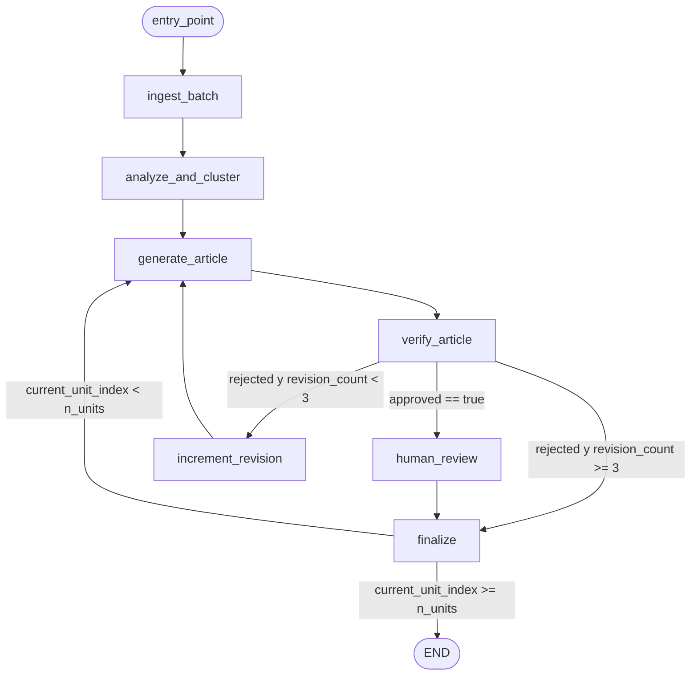
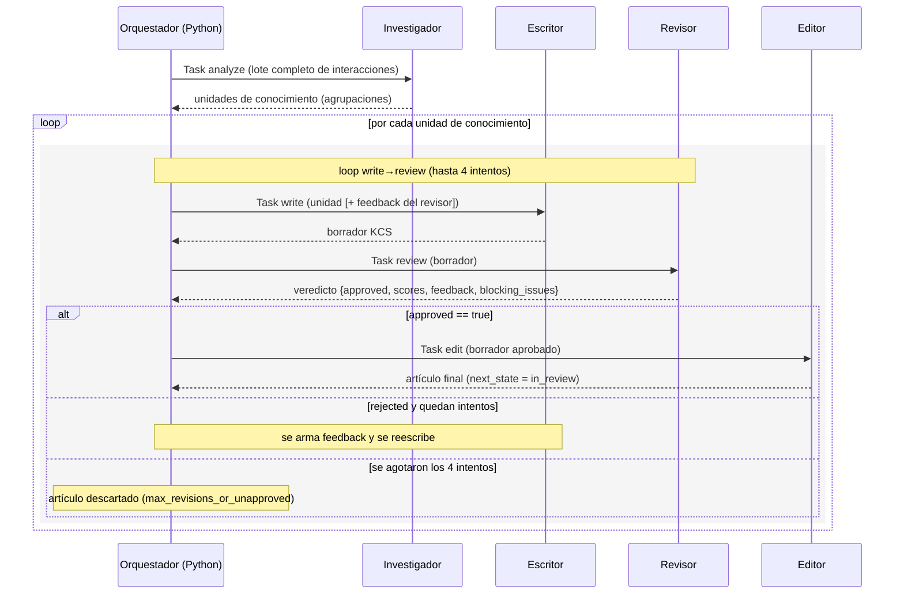
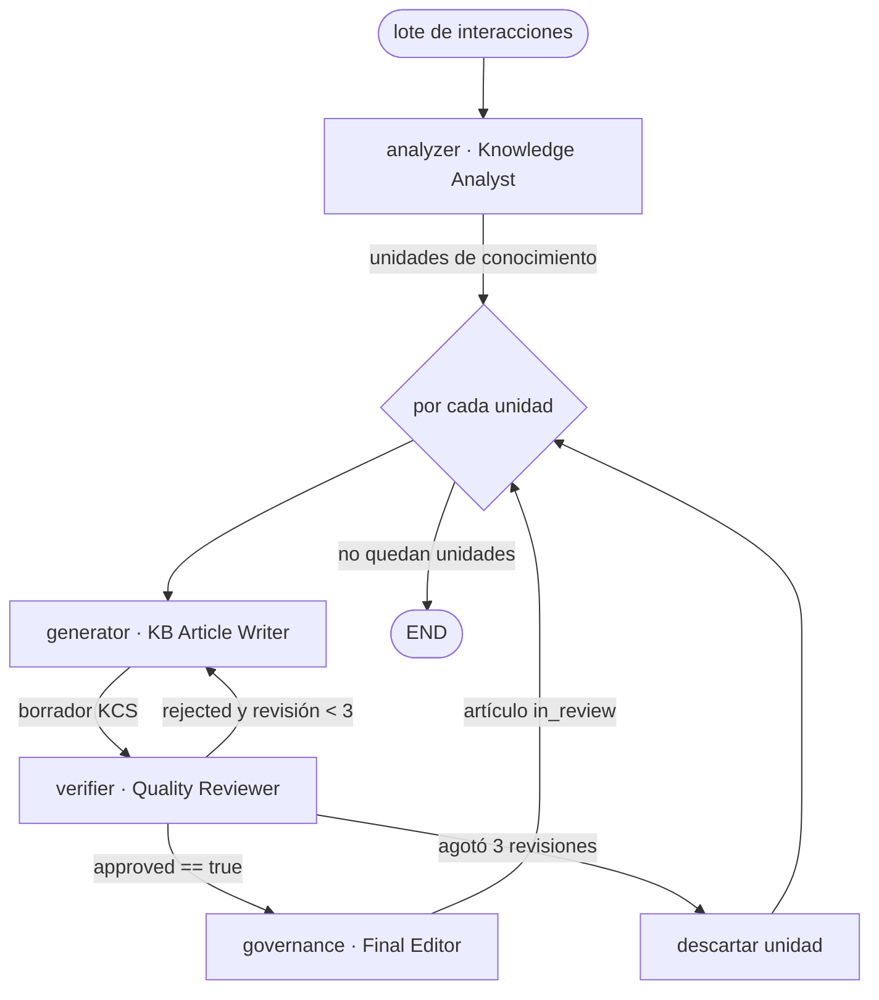

# Diagramas de orquestación

Diagramas Mermaid del flujo **real** de cada framework, derivados del código
fuente (`src/frameworks/`). No son esquemas idealizados: reflejan los nodos,
transiciones y condiciones efectivamente implementados.

---

## a) LangGraph — grafo de estados

`StateGraph` compilado en `src/frameworks/langgraph/graph.py`, con ruteo
condicional en `route_after_verify` y `route_after_finalize`
(`src/frameworks/langgraph/nodes.py`). El límite de revisiones por unidad es 3
(`max_revisions`).



**Transiciones condicionales (exactas del código):**

- `route_after_verify`: si el veredicto tiene `approved == true` → `human_review`;
  si no aprobó y `revision_count >= max_revisions (3)` → `finalize` (se abandona la
  unidad); en otro caso → `increment_revision` (que incrementa el contador y
  vuelve a `generate_article`).
- `route_after_finalize`: si `current_unit_index >= len(knowledge_units)` → `END`;
  si quedan unidades → `generate_article`.

**Estado tipado (`ContentBuilderState`, `state.py`):**

```python
class ContentBuilderState(TypedDict, total=False):
    # Datos de entrada / orquestación
    interactions: List[Dict[str, Any]]
    knowledge_units: List[Dict[str, Any]]
    current_unit_index: int
    current_draft: Optional[Dict[str, Any]]
    revision_count: int
    # Salidas acumulativas (reducer operator.add = append)
    generated_articles: Annotated[List[Dict[str, Any]], operator.add]
    article_interaction_map: Dict[str, List[str]]
    traces: Annotated[List[Dict[str, Any]], operator.add]
    errors: Annotated[List[Dict[str, Any]], operator.add]
    # Métricas y configuración
    metrics: Dict[str, Any]
    config: Dict[str, Any]
    # Veredicto efímero del nodo verify_article
    last_verification: Optional[Dict[str, Any]]
    last_feedback: Optional[str]
```

---

## b) CrewAI — secuencia de agentes y loop de revisión

`src/frameworks/crewai/runner.py`. Cuatro agentes (`Investigador`/Knowledge
Analyst, `Escritor`/KB Article Writer, `Revisor`/Quality Reviewer, `Editor`/Final
Editor) ejecutados como tareas secuenciales (`Process.sequential`). El loop
write→review reintenta hasta `max_revisions + 1 = 4` intentos por unidad.



**Notas del código:** si el analyzer no produce agrupaciones, el runner cae a
*singletons* (un grupo por interacción). Con `auto_approve=true` el paso de
`human_review` se simula (no hay humano en el bucle). El veredicto del `Revisor`
controla la salida del loop: `approved` rompe el bucle hacia el `Editor`; un
rechazo arma feedback y reintenta.

---

## c) OpenAI Agents — handoffs entre agentes

`src/frameworks/openai_agents/runner.py`. Cuatro `Agent` nativos del SDK
(`analyzer`, `generator`, `verifier`, `governance`); **los handoffs no son los
nativos del SDK: la topología la decide el orquestador en Python**, con un corte
duro de 3 revisiones por unidad.



**Direcciones y condiciones de handoff (orquestadas en Python):**

- `analyzer → generator`: tras agrupar, se entrega cada unidad al generador.
- `generator → verifier`: cada borrador pasa al verificador.
- `verifier → governance`: si el veredicto es `approved`.
- `verifier → generator`: si rechaza y aún quedan revisiones (< 3) — se reescribe con feedback.
- `verifier → (descarte)`: si se agotan las 3 revisiones sin aprobar.
- `governance → (siguiente unidad)`: el artículo queda listo para revisión humana.

> Los tres frameworks comparten la misma lógica de orquestación de alto nivel
> (analizar → [escribir → verificar]\* → gobernar, con 3 revisiones máximas), pero
> difieren en el sustrato: grafo de estados (LangGraph), tareas secuenciales de
> agentes (CrewAI) y handoffs simulados sobre Agents del SDK (OpenAI).
